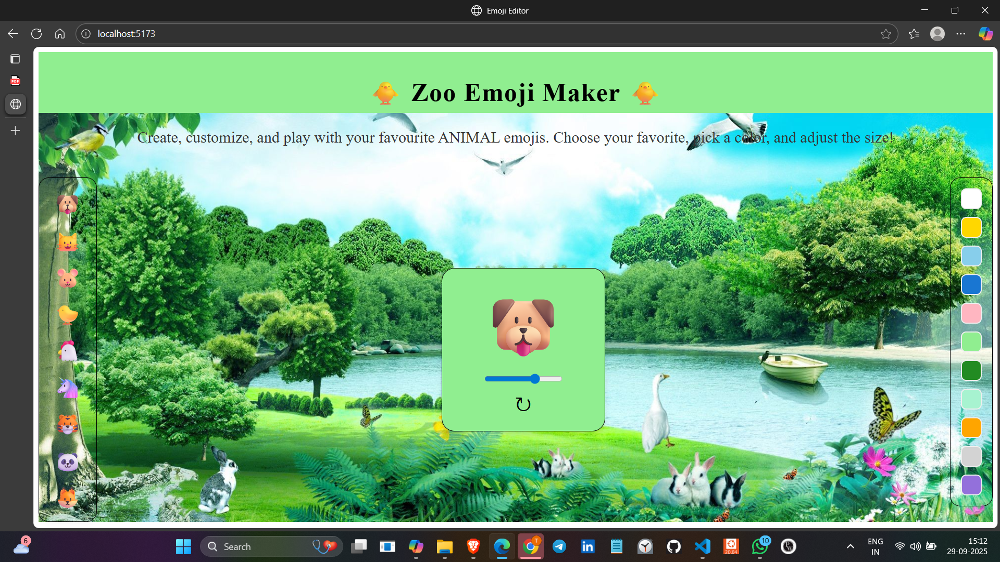

# 😎 Zoo Emoji Maker 🌻

**Customize, color, and play with emojis in a fun React-powered UI!**

## 🚀 Overview

**My Emoji Playground** is an interactive web app built with React that lets users personalize emojis by selecting different icons, adjusting their size with a slider, and changing their background color. Designed with a clean layout and playful styling, this project demonstrates dynamic state management, component-based architecture, and responsive design.

---

## ✨ Features

- 🎨 Emoji selection from a vertical toolbar
- 🌈 Color customization using a palette sidebar
- 📏 Size adjustment with a slider
- 🔄 Reset button to restore default settings
- 📱 Responsive and user-friendly interface

---

## 🛠️ Tech Stack

| Frontend | Styling | Icons |
|----------|---------|-------|
| React    | CSS     | Unicode Emojis |

---

## 📸 Screenshots

